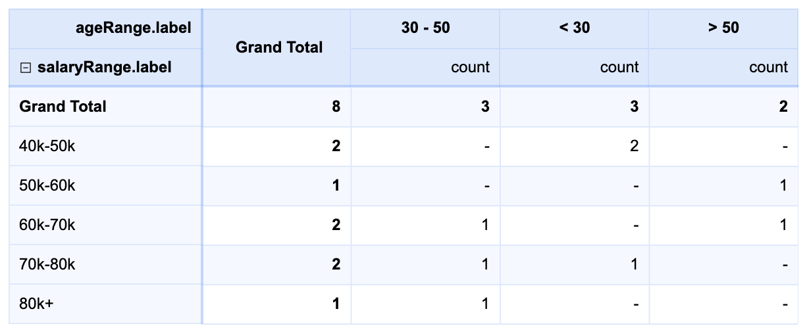
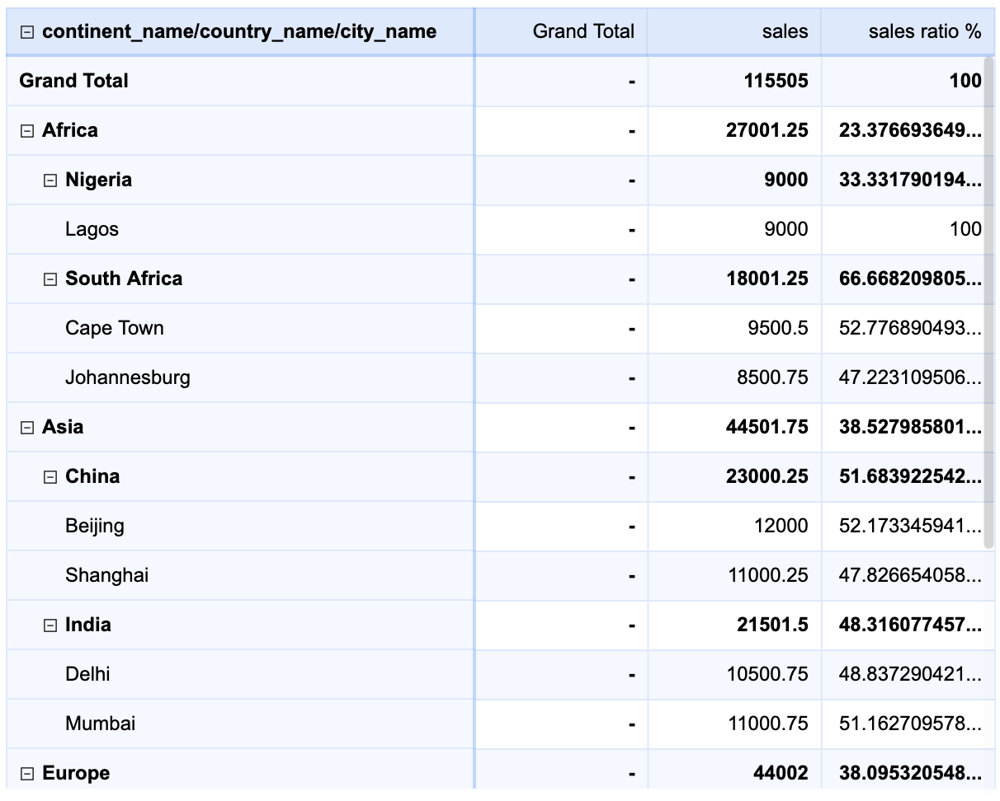
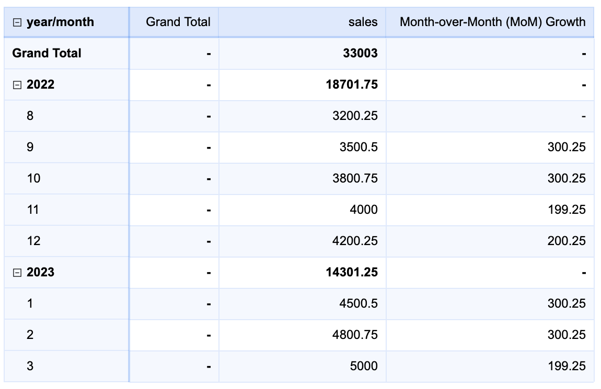

<p align="center">
  
</p>

<p align="center">
  <a href="https://github.com/squashql/squashql/actions">
    
  </a>
  <a>
    
  </a>
  <a>
    
  </a> 
</p>

<h4 align="center">
  <a href="https://github.com/squashql/squashql#-key-features">Key features</a> |
  <a href="https://github.com/squashql/squashql-showcase">Tutorial</a> |
  <a href="https://github.com/squashql/squashql#-documentation">Docs</a> |
  <a href="https://github.com/squashql/squashql#-resources">Resources</a> |
  <a href="https://discord.gg/p7dg2wEwFs">Chat</a>
</h4>
<br/>

---

SquashQL is an open-source SQL query engine designed to streamline the process of building multi-dimensional queries.
At its core, it acts as a middleware layer that stands between SQL databases and multiple clients or front-end
applications.
The primary objective is twofold: to empower back-end developers in optimizing SQL database usage and to provide
front-end developers with an intuitive API for configuring metrics in the UI.

It follows a "write once, run everywhere" philosophy, making it an excellent solution for scenarios where data needs to 
be efficiently queried from multiple databases. Currently, SquashQL supports compatibility with databases such as Apache Spark,
ClickHouse, BigQuery, Snowflake, PostgreSQL and DuckDB.

## 💡 Key features

### Simple API

Typescript SQL-like query builder available on [npm](https://www.npmjs.com/package/@squashql/squashql-js). This empowers developers to construct and execute SQL queries directly
from their applications, utilizing a syntax that feels familiar and expressive.

```typescript
import {
  from, avg, TableField
} from "@squashql/squashql-js"

class Orders {
  readonly _name: string = "Orders"
  readonly customer_id: TableField = new TableField("Orders.customer_id")
  readonly amount: TableField = new TableField("Orders.amount")
}

const orders = new Orders()

const q = from(orders._name)
        .select([orders.customer_id], [], [avg("average_spends", orders.amount)])
        .build()
```

[Full API documentation](documentation/QUERY.md)

### Pivot Table

Create pivot table in SQL with a simple and intuitive syntax. Totals and subtotals **are computed by the database**.

```typescript
const pivotConfig: PivotConfig = {
  rows: [sales.product, sales.region],
  columns: [sales.month]
}
const query = from(sales._name)
        .select([sales.product, sales.region, sales.month], [], [sum("sales", sales.revenue)])
        .build()
querier.executePivotQuery(query, pivotConfig)
```


👉 https://jsfiddle.net/azeq/c6f9ox4u/

Try the [tutorial](https://github.com/squashql/squashql-showcase/blob/main/TUTORIAL.md#pivot-table) to build your own pivot table.

### Bucketing

Bucketing, also known as binning or discretization, is a technique used in data analysis to group continuous or
numerical data into discrete intervals or "buckets."

<details><summary>SQL</summary>

```sql
-- Create a sample employees table
CREATE TABLE employees
(
  employee_id   INT PRIMARY KEY,
  employee_name VARCHAR(255),
  salary        DECIMAL(10, 2),
  age           INT
);
-- Insert some sample data
INSERT INTO employees (employee_id, employee_name, salary, age)
VALUES (1, 'John Doe', 50000.00, 50),
       (2, 'Jane Smith', 65000.00, 33),
       (3, 'Bob Johnson', 80000.00, 42),
       (4, 'Alice Brown', 40000.00, 21),
       (5, 'Peter Parker', 61000.00, 55),
       (6, 'Jack Black', 73000.00, 39),
       (7, 'Nicole Williams', 44000.00, 25),
       (8, 'Charlie Wilson', 72000.00, 28);
```

</details>

Data:
```
+-------------+-----------------+---------+-----+
| employee_id |   employee_name |  salary | age |
+-------------+-----------------+---------+-----+
|           1 |        John Doe | 50000.0 |  50 |
|           2 |      Jane Smith | 65000.0 |  33 |
|           3 |     Bob Johnson | 80000.0 |  42 |
|           4 |     Alice Brown | 40000.0 |  21 |
|           5 |    Peter Parker | 61000.0 |  55 |
|           6 |      Jack Black | 73000.0 |  39 |
|           7 | Nicole Williams | 44000.0 |  25 |
|           8 |  Charlie Wilson | 72000.0 |  28 |
+-------------+-----------------+---------+-----+
```

Easy to bucket on one or several attributes.
Result can be displayed in
a [pivot table](https://github.com/squashql/squashql-showcase/blob/main/TUTORIAL.md#pivot-table)
to enhance data visualization and help analysis.



👉 https://jsfiddle.net/azeq/r1xfqt89/

[More](https://github.com/squashql/squashql/blob/main/documentation/QUERY.md#joining-on-virtual-created-on-the-fly-at-query-time)

### Comparison or hierarchical measures

Make calculations that are cumbersome or challenging in SQL easy to perform.

Hierarchical measures are multidimensional measures that are calculated based on the relationships between values in 
different levels of a hierarchy. This allows for the calculation of percentages, ratios, and other comparisons that 
provide insights into the distribution and change of data over time or across different levels of a hierarchy.

#### Hierarchical / Parent-Child comparison

💡 Compare aggregates and sub-aggregates computed at different levels of a lineage. A lineage is defined on-the-fly 
at query time. In below example, it is defined as `continent_name -> country_name -> city_name`.



👉 https://jsfiddle.net/azeq/31qs2jyt/

#### Time-series comparison

💡 Compare aggregates between time period like year, semester, quarter, month.



👉 https://jsfiddle.net/azeq/dqebkp2x/

[More](documentation/QUERY.md#complex-comparison)

### Drilling across

Query two or more fact tables and stitch together the results on shared columns. SquashQL will fill aggregated values with 
null for entries that are not compatible with the result they come from.

```
Result query 1                        Result query 2
+-------------+---------------+       +-------------+-------------+-------------------+
|     product | quantity sold |       |     product |      reason | quantity returned |
+-------------+---------------+       +-------------+-------------+-------------------+
| Grand Total |            54 |       | Grand Total | Grand Total |                 5 |
|           A |            15 |       |           A |       Total |                 1 |
|           B |            23 |       |           A |   defective |                 1 |
|           C |            16 |       |           C |       Total |                 3 |
+-------------+---------------+       |           C |    unwanted |                 3 |
                                      |           D |       Total |                 1 |
                                      |           D |    unwanted |                 1 |
                                      +-------------+-------------+-------------------+
```

Drilling across result (with left join)


👉 https://jsfiddle.net/azeq/702gxqcb/

N query results can be merged, `N >= 2`.

[More](documentation/DRILLING-ACROSS.md)

### Query cache

SquashQL provides an in-memory query cache to not re-execute queries already executed.
Caching can be customized or deactivated.

[More](documentation/CACHE.md)

### Output format

SquashQL supports several output format :

* `text/plain`
* `text/csv` (with `Content-Disposition` header allowing file download)
* `application/json`

The default format for SquashQL is `application/json`.
To override this behavior and choose the selected output format, simply pass an `Accept` header when instantiating the querier :

```javascript
const csvQuerier = new Querier(url, {
    headers: {
        'Accept': 'text/plain',
    }
});
```

## 🎓 Try SquashQL

You can try SquashQL directly from your web browser with [our showcase project](https://github.com/squashql/squashql-showcase/blob/main/TUTORIAL.md). No need to install anything!

## 📕 Documentation

- [Configuration](documentation/CONFIGURATION.md): learn how to connect SquashQL to your database.
- [API tour](documentation/API.md): a quick introduction to the API.
- [Typescript API Handbook](documentation/QUERY.md)
- [Drilling across](documentation/DRILLING-ACROSS.md)
- [Cache](documentation/CACHE.md)

## 📚 Resources

- [Typescript library](https://www.npmjs.com/package/@squashql/squashql-js) 
- [Tutorial](https://github.com/squashql/squashql-showcase/blob/main/TUTORIAL.md)

## 🤝 Contributing

We are always thrilled to receive contributions: code, documentation, issues, or feedback.

- Start by checking out the GitHub issues. These are a great place for newcomers to contribute.
- Read our [Code of Conduct](CODE-OF-CONDUCT.md) to understand our community standards.
- Read our [contributing guidelines](CONTRIBUTING.md) to understand how to contribute.
- Create a fork to have your own copy of the repository where you can make changes. 
- Once you've made your changes and tested them, you can contribute by submitting a pull request.

If you can't find something you'd want to use or want to share your ideas, please open an issue or join our [discord server](https://discord.gg/p7dg2wEwFs).

## 💬 Join Our Community

We welcome everyone to our community! Whether you're contributing code or just saying hello, we'd love to hear from you. 
Join our [discord server](https://discord.gg/p7dg2wEwFs)!
