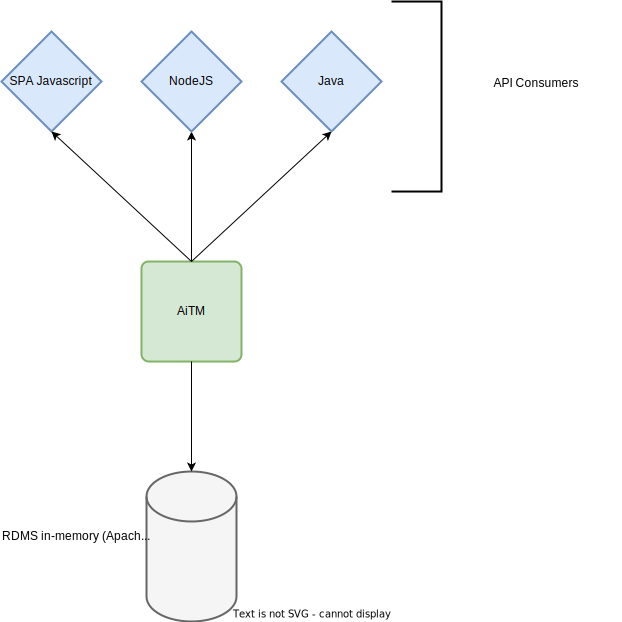
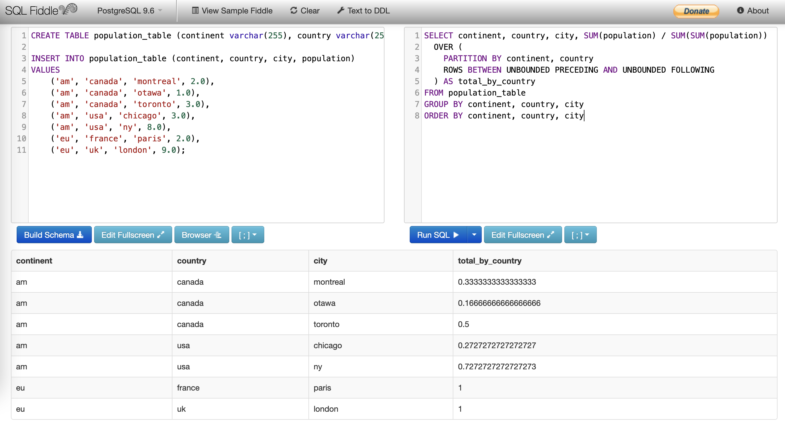

# AITM

Query Engine is:
- an application that enables users to execute complex SQL queries without writing a single SQL query !
- compatible with several popular SQL databases (clickhouse, spark, bigquery...)
- stateless and "schema-less"



## Use case 1: Percent of Parent

How to compute the percent of parent?
```
+-----------+---------+----------+------------+
| continent | country |     city | population |
+-----------+---------+----------+------------+
|        am |  canada | montreal |        2.0 |
|        am |  canada |    otawa |        1.0 |
|        am |  canada |  toronto |        3.0 |
|        am |     usa |  chicago |        3.0 |
|        am |     usa |      nyc |        8.0 |
|        eu |  france |     lyon |        0.5 |
|        eu |  france |    paris |        2.0 |
|        eu |      uk |   london |        9.0 |
+-----------+---------+----------+------------+
```
One way to do it in SQL is by using window functions (another way via subqueries?)

### SQL - QUERY AT CITY LEVEL
```sql
SELECT continent, country, city, SUM(population) / SUM(SUM(population))
  OVER (
    PARTITION BY continent, country
    ROWS BETWEEN UNBOUNDED PRECEDING AND UNBOUNDED FOLLOWING
  ) AS total_by_country
FROM population_table 
GROUP BY continent, country, city
ORDER BY continent, country, city
```



### SQL - QUERY AT COUNTRY LEVEL
```sql
SELECT continent, country, SUM(population) / SUM(SUM(population))
  OVER (
    PARTITION BY continent
    ROWS BETWEEN UNBOUNDED PRECEDING AND UNBOUNDED FOLLOWING
  ) AS total_by_country
FROM population_table 
GROUP BY continent, country
ORDER BY continent, country
```

### AITM

```java
Measure pop = sum("population", "population");
QueryDto query = query()
        .table("population_table")
        .withColumn("continent")
        .withColumn("country")
        .withColumn("city")
        .withMeasure(pop);

ParentComparisonMeasure pOp = parentComparison(
	"percentOfParent", 
	ComparisonMethod.DIVIDE, 
	pop, 
	List.of("city", "country", "continent"));
query.withMeasure(pOp);
```

## SQL Fiddle

```sql
CREATE TABLE population_table (continent varchar(255), country varchar(255), city varchar(255), population float);

INSERT INTO population_table (continent, country, city, population)
VALUES
    ('am', 'canada', 'montreal', 2.0),
    ('am', 'canada', 'otawa', 1.0),
    ('am', 'canada', 'toronto', 3.0),
    ('am', 'usa', 'chicago', 3.0),
    ('am', 'usa', 'ny', 8.0),
    ('eu', 'france', 'paris', 2.0),
    ('eu', 'uk', 'london', 9.0);
```

