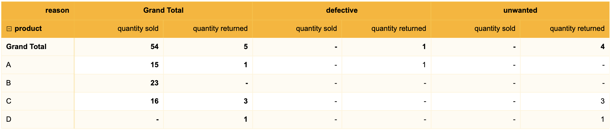

## Drilling across

Drilling across or Drill across refers to a reporting feature that let you querying two or more fact tables.
Aggregated results are then stitch together on shared columns. There are several strategies to *stitch*
the results. Let's see various examples to learn how SquashQL does it.  

### API

The API supports joining N query results. 

```typescript
const query1 = Query.from("table1").select(...)
const query2 = Query.from("table2").select(...)
const query3 = Query.from("table3").select(...)

const queryMerge = new QueryMerge(query1)
        .join(query2, JoinType.LEFT)
        .join(query3, JoinType.INNER)

querier.executeQuery(queryMerge)
        .then(result => console.log(result))
```

### Examples

#### Schema

Information about shipments and returns is captured in two tables: shipment and return. 

`shipment` captures the quantity of products sold:
```
+---------+----------+
| product | quantity |
+---------+----------+
|       A |       15 |
|       B |       23 |
|       C |       16 |
+---------+----------+
```

`return` captures the quantity of products returned:
```
+---------+----------+-----------+
| product | quantity |    reason |
+---------+----------+-----------+
|       A |        1 | defective |
|       C |        3 |  unwanted |
+---------+----------+-----------+
```

#### Case 1: results have all columns in common

Now let's ask to group by on product with a rollup to have a summary of each table:

```typescript
class Shipment {
  readonly _name: string = "shipment"
  readonly product: TableField = new TableField("shipment.product")
  readonly quantity: TableField = new TableField("shipment.quantity")
}
const shipment = new Shipment()

const query = from(shipment._name)
        .select([shipment.product], [], [sum("quantity sold", shipment.quantity)])
        .rollup([shipment.product])
        .build()
```

Result:
```
+-------------+---------------+
|     product | quantity sold |
+-------------+---------------+
| Grand Total |            54 |
|           A |            15 |
|           B |            23 |
|           C |            16 |
+-------------+---------------+
```

A similar query can be executed on `return` table.
```typescript
class Return {
  readonly _name: string = "return"
  readonly product: TableField = new TableField("return.product")
  readonly quantity: TableField = new TableField("return.quantity")
  readonly reason: TableField = new TableField("return.reason")
}
const returnTable = new Return()

const query = from(returnTable._name)
        .select([returnTable.product], [], [sum("quantity returned", returnTable.quantity)])
        .rollup([returnTable.product])
        .build()
```

Result:
```
+-------------+-------------------+
|     product | quantity returned |
+-------------+-------------------+
| Grand Total |                 5 |
|           A |                 1 |
|           C |                 3 |
|           D |                 1 |
+-------------+-------------------+
```

To see both aggregate values quantity returned and quantity sold in the same table, we can use drilling across feature
of SquashQL. Two queries need to be defined and how results of those queries should be joined. Three join strategies are
possible: FULL, INNER, LEFT.

```typescript
const queryShipment = from(shipment._name)
        .select([shipment.product], [], [sum("quantity sold", shipment.quantity)])
        .rollup([shipment.product])
        .build()
const queryReturn = from(returnTable._name)
        .select([returnTable.product], [], [sum("quantity returned", returnTable.quantity)])
        .rollup([returnTable.product])
        .build()
```

The results will be *merged* or *stitched* together on their common columns that are not aggregated values. In this case: product.
Missing values will be filled with `null`.

##### FULL

```typescript
querier.executeQuery(new QueryMerge(queryShipment).join(queryReturn, JoinType.FULL))
        .then(result => console.log(result))
```

In `return` table, there is no entry for product `B` so the quantity returned value is set to `null`. In `shipment` 
table, there is no entry for product `D` so the quantity sold value is set to `null`. The type of join is `FULL` so both
entries are kept.

```
+-------------+---------------+-------------------+
|     product | quantity sold | quantity returned |
+-------------+---------------+-------------------+
| Grand Total |            54 |                 5 |
|           A |            15 |                 1 |
|           B |            23 |              null |
|           C |            16 |                 3 |
|           D |          null |                 1 |
+-------------+---------------+-------------------+
```

##### LEFT

```typescript
querier.executeQuery(new QueryMerge(queryShipment).join(queryReturn, JoinType.LEFT))
        .then(result => console.log(result))
```

In `return` table, there is no entry for product `B` so the quantity returned value is set to `null`. In `shipment`
table, there is no entry for product `D` but the join type is `LEFT` so this entry is discarded.

```
+-------------+---------------+-------------------+
|     product | quantity sold | quantity returned |
+-------------+---------------+-------------------+
| Grand Total |            54 |                 5 |
|           A |            15 |                 1 |
|           B |            23 |              null |
|           C |            16 |                 3 |
+-------------+---------------+-------------------+
```

##### INNER

```typescript
querier.executeQuery(new QueryMerge(queryShipment).join(queryReturn, JoinType.INNER))
        .then(result => console.log(result))
```

In `return` table, there is no entry for product `B` and in `shipment` table, there is no entry for product `D` and the 
join type is `INNER` so both entries are discarded.

```
+-------------+---------------+-------------------+
|     product | quantity sold | quantity returned |
+-------------+---------------+-------------------+
| Grand Total |            54 |                 5 |
|           A |            15 |                 1 |
|           C |            16 |                 3 |
+-------------+---------------+-------------------+
```

#### Case 2: results have not all columns in common

Let's change the second query and add `reason` to the select.

```typescript
const queryReturnWithReason = from(returnTable._name)
        .select([returnTable.product, returnTable.reason], [], [sum("quantity returned", returnTable.quantity)])
        .rollup([returnTable.product, returnTable.reason])
        .build()
```

When executed this query individually, the result looks like:
```
+-------------+-------------+-------------------+
|     product |      reason | quantity returned |
+-------------+-------------+-------------------+
| Grand Total | Grand Total |                 4 |
|           A |       Total |                 1 |
|           A |   defective |                 1 |
|           C |       Total |                 3 |
|           C |    unwanted |                 3 |
|           D |       Total |                 1 |
|           D |    unwanted |                 1 |
+-------------+-------------+-------------------+
```

```typescript
const queryShipment = from(shipment._name)
        .select([shipment.product], [], [sum("quantity sold", shipment.quantity)])
        .rollup([shipment.product])
        .build()
const queryReturnWithReason = from(returnTable._name)
        .select([returnTable.product, returnTable.reason], [], [sum("quantity returned", returnTable.quantity)])
        .rollup([returnTable.product, returnTable.reason])
        .build()

querier.executeQuery(new QueryMerge(queryShipment, queryReturnWithReason, JoinType.FULL))
        .then(result => console.log(result))
```

Only one column over two is common between the aggregated results: `product`. The second result contains `reason` which 
does not exist in the first result.

SquashQL will fill aggregated values with `null` for entries that are not compatible with the result they come from. In 
our case, these entries are `["A", "defective"]`, `["C", "unwanted"]` and `["D", "unwanted"]` for quantity sold.
They do not exist in the first result because the column reason is not present so the values of quantity sold in the
table for these entries are set to `null`.

For other entries, the values of `reason` is either `Total` or `Grand Total` and in that case reason values are ignored
and
values for quantity sold are simply copy from the first result.

```
+-------------+-------------+---------------+-------------------+
|     product |      reason | quantity sold | quantity returned |
+-------------+-------------+---------------+-------------------+
| Grand Total | Grand Total |            54 |                 5 |
|           A |       Total |            15 |                 1 |
|           A |   defective |          null |                 1 |
|           B |       Total |            23 |              null |
|           C |       Total |            16 |                 3 |
|           C |    unwanted |          null |                 3 |
|           D |       Total |          null |                 1 |
|           D |    unwanted |          null |                 1 |
+-------------+-------------+---------------+-------------------+
```

It can also be displayed as a pivot table:


👉 https://jsfiddle.net/azeq/702gxqcb/

```typescript
const queryShipment = from(shipment._name)
        .select([shipment.product], [], [sum("quantity sold", shipment.quantity)])
        .build()
const queryReturnWithReason = from(returnTable._name)
        .select([returnTable.product, returnTable.reason], [], [sum("quantity returned", returnTable.quantity)])
        .build()

const pivotConfig: PivotConfig = {
  rows: [shipment.product],
  columns: [returnTable.reason]
}

querier.executePivotQuery(new QueryMerge(queryShipment, queryReturnWithReason, JoinType.FULL), pivotConfig)
        .then(result => console.log(result))
```

Note `PivotConfig` accept another boolean parameter: `minify` set to true by default. It indicates if columns full of null
values should be returned or not in the final result. If set to false:

```typescript
const pivotConfig: PivotConfig = {
  rows: [shipment.product],
  columns: [returnTable.reason], 
  minify: false
}
```



### Limit

SquashQL has an implicit limit query result set to 10000. In case of drilling across, this limit is applied to the queries
used in the `QueryMerge` before combining the result. Since the final result can be wrong if at least one of the results
exceeds the limit, an `LimitExceedException` exception is thrown with the following message: `query limit exceeded`.

